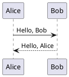

# HELP

## UML

Using [PlantUML](https://plugins.gitbook.com/plugin/plantuml) to draw UML.



## Check Box

```bash
- [ ] Uncompleted task.
- [x] Completed task.
```

- [ ] Uncompleted task.
- [x] Completed task.